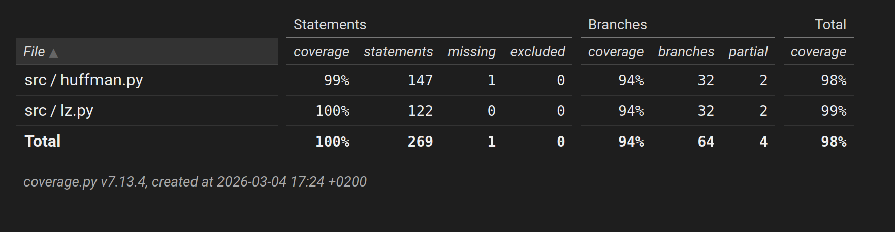

# Testaus

Testikattavuus (6.3.2026)

## Ysikkötestit

Kaikki metodit on yksikkötestattu. Huomiona huffmanin binary_string_to_tree-funktiosta: Tässä käytän elif-lauseketta selkeyden takia (tapaukset nollalle ja ykköselle selkeästi erikseen). LZ:ssä varmistetaan, että ohjelma pysähtyy erroriin väärillä tyypeillä.

Pakkaamisen oikeellisuutta testataan muutamalla eri tyyppisellä syötteellä:

- Hyvin lyhyt yksinkertainen teksti
- Pidempi teksti (LZ:ssä yli 4096 viitettä) (tarkistetaan pakkausteho)
- Rivinvaihdoilla aloittaminen ja lopettaminen
- Vain yhtä merkkiä sisältävät tekstit eri pituuksilla

## Pakkaustehon vertailu

Testidatana War and Peace vähemmällä whitespacella, suurin versio noin 3MB. Tässä versiossa edelleen sisennys tehdään välilyönnillä, mikä suosii huffman-algoritmia.

Testaus on tehty tämän rivin kirjoituksen aikaisen commitin main-tiedostossa olevilla käskyillä. Molemmilla algoritmeilla on tarkistettu pakkaamisen oikeellisuus vertailun yhteydessä.

## Huomio testausdataan liittyen

Nämä testit on tehty ilman whitespacea. Esimerkiksi War and Peace whitespacen kanssa käyttäytyy seuraavasti:

Original file size: 4434670 bytes
Binary file size: 2097946 bytes
Compression ratio: 47.31%

### 1kB

- lz78 100.67%

- huffman: 63.12%

### 4kB

- lz78: 82.26%

- huffman: 58.25%

### 16kB

- lz78: 67.61%

- huffman: 56.97%

### 64kB

- lz78: 61.08%

- huffman: 56.49%

### 256kB

- lz78: 59.94%

- huffman: 56.31%

### 1MB

- lz78: 59.93%

- huffman: 56.26%

### 2MB

- lz78: 59.97%

- huffman: 56.17%

### 3MB

- lz78: 59.97%

- huffman: 56.02%

Molemmilla algoritmeilla pakkausteho paranee mitä suurempaan tiedostoon siirrytään. Tämän vertailun tuloksena on se, että Huffman-koodaus on tälle syötteelle tehokkaampi pakkaustapa kuin LZ78.

16kB tiedostossa saadaan LZ78-algoritmilla hieman yli 4096 riviä tauluun, minkä jälkeen uusia yhdistelmiä ei enää etsitä. Luultavasti tämän takia pakkausteho ei kasva huomattavasti 16kB suuremmilla tiedostoilla, kun käytetään LZ78-algoritmia.

Huffmanista myös huomaa, että se on melko tehokas jo pienemmilläkin tiedostoilla. Kuten aiemmin mainittiin, testidata suosii jonkin verran Huffman-koodausta, sillä kirjassa on tehty sisennyksiä usealla välilyönnillä.
